# TidyTuesday

## 2020-01-07 - Australia temperature and rainfall

## 2021-08-24 - Lemurs
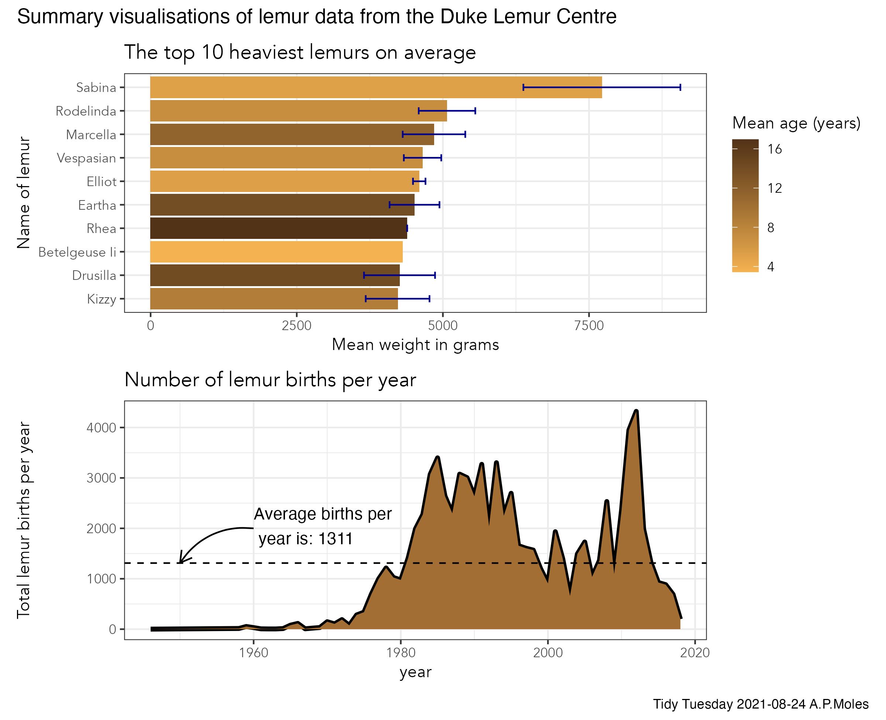

## 2021-10-19 - Pumpkins!
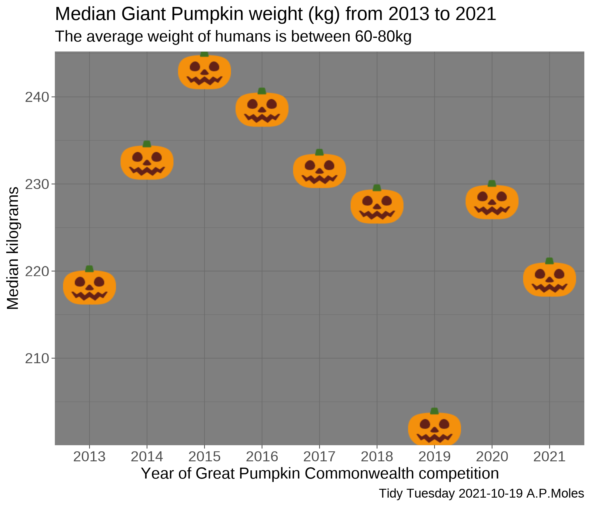
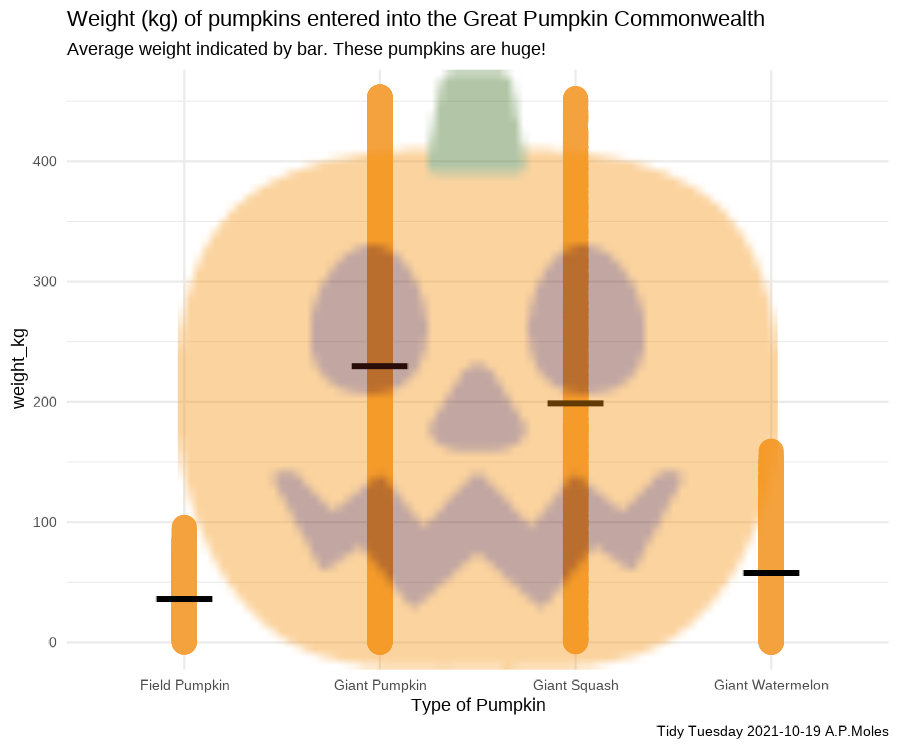

## 2021-10-26 - Ultra Trail Running
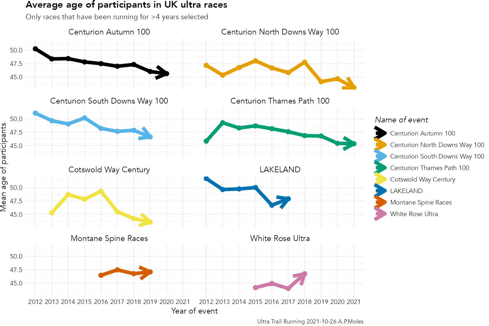

## 2021-11-11 - Maps (elevation maps with rayshader and elevatr)
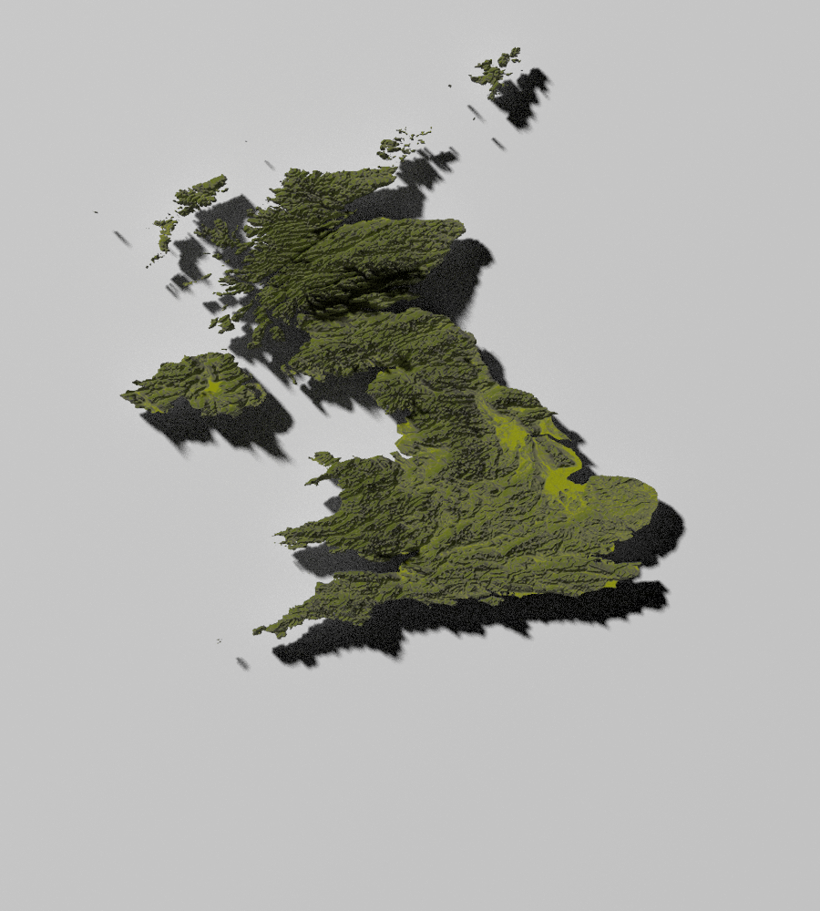

## Data from Pokémon games
Scraped from <https://pokemondb.net/>, scraping code on [Github](https://github.com/andrewmoles2/webScraping/blob/main/R/pokemonDatabase.R)
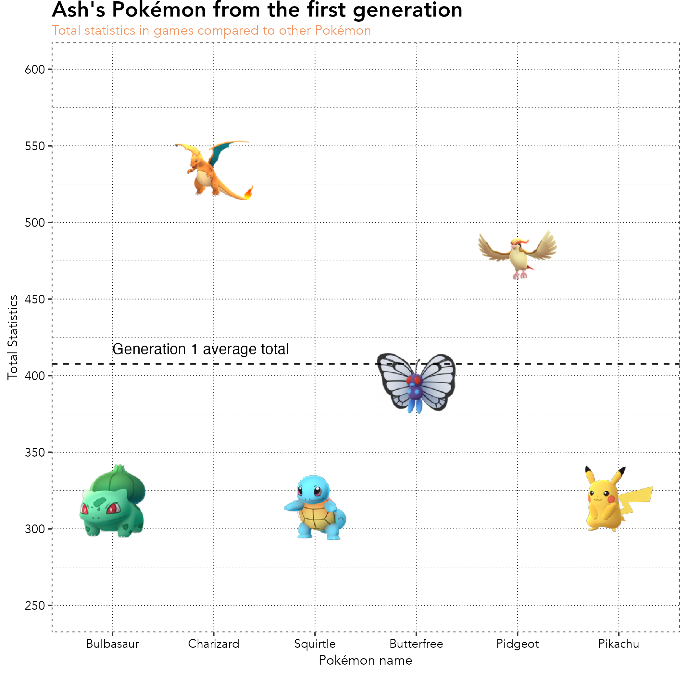

## 2021-11-23 Dr Who
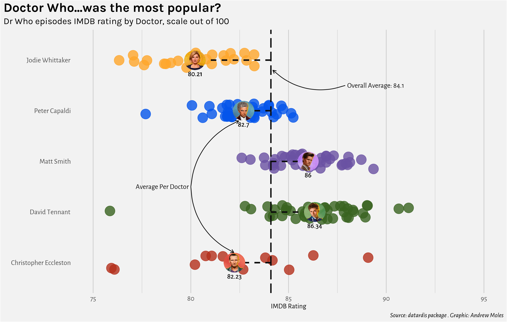

## 2021-11-30 Cricket World Cup (1996-2003)
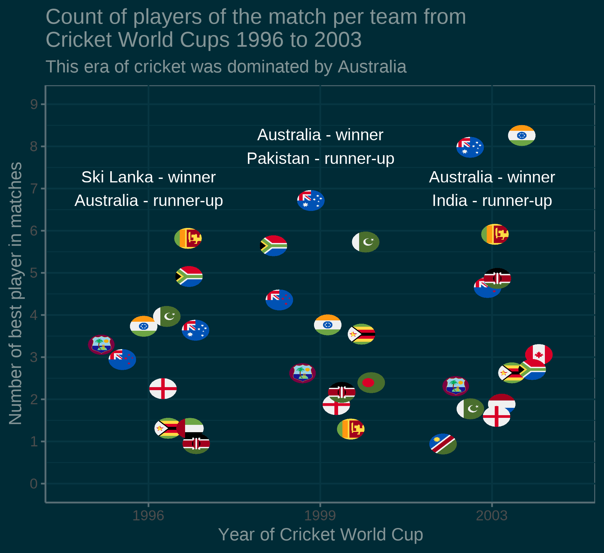
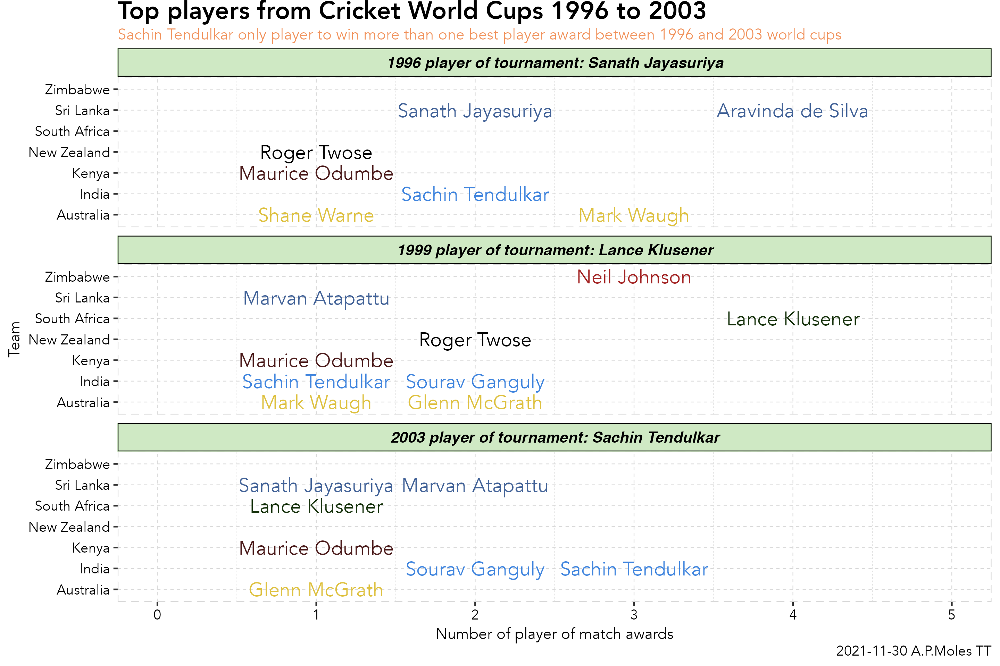

## 2021-12-07 Spiders
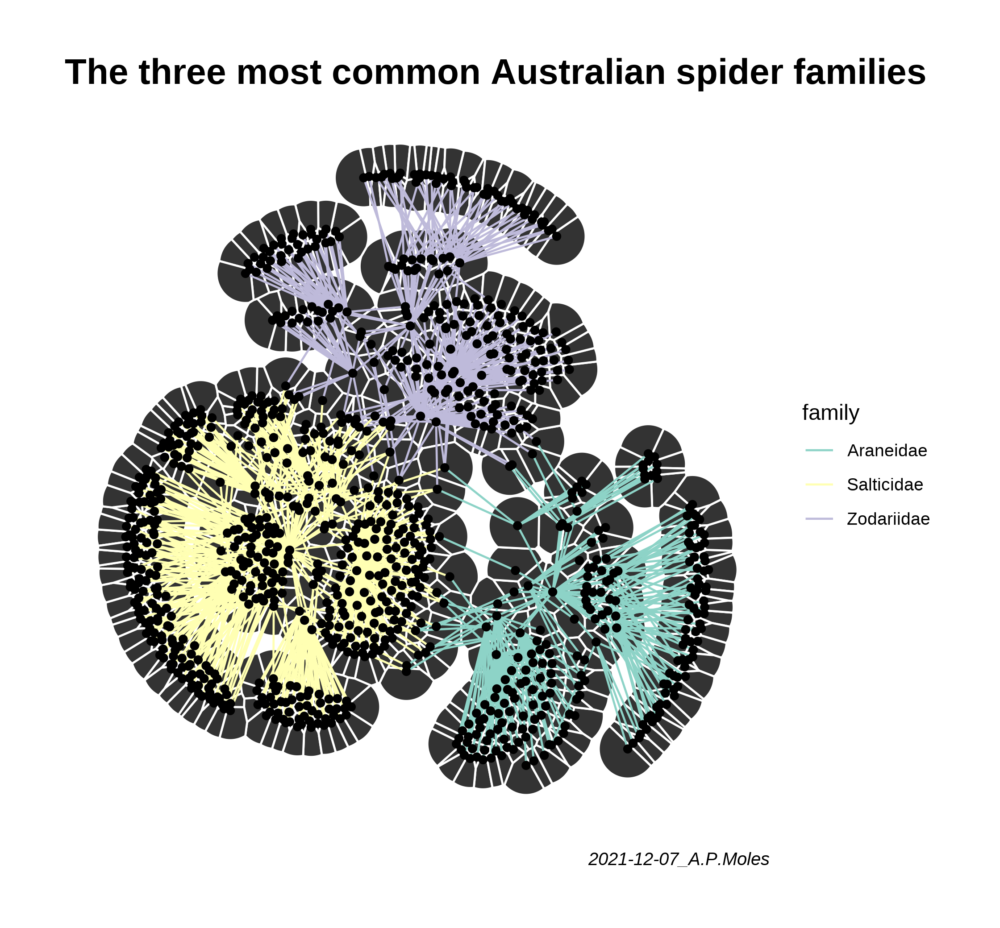

## 2021-12-14 Spice Girls
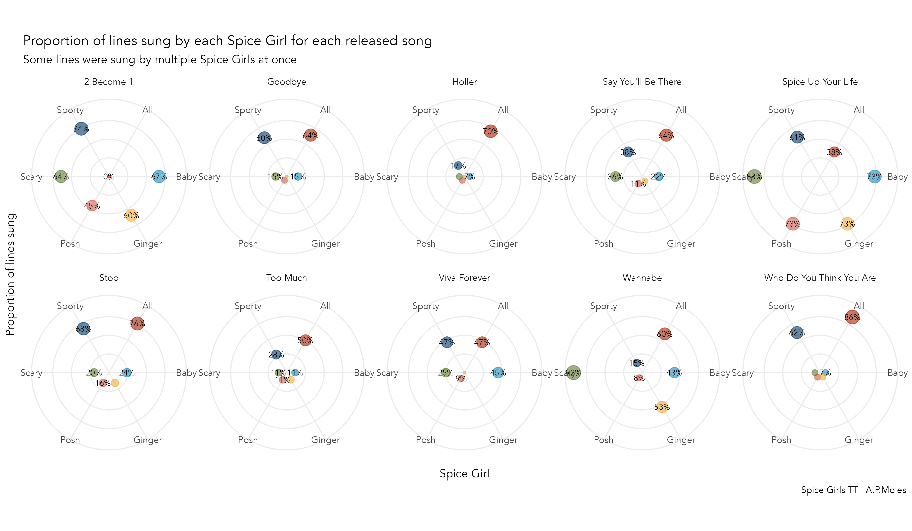

## 2022-01-11 Bees!
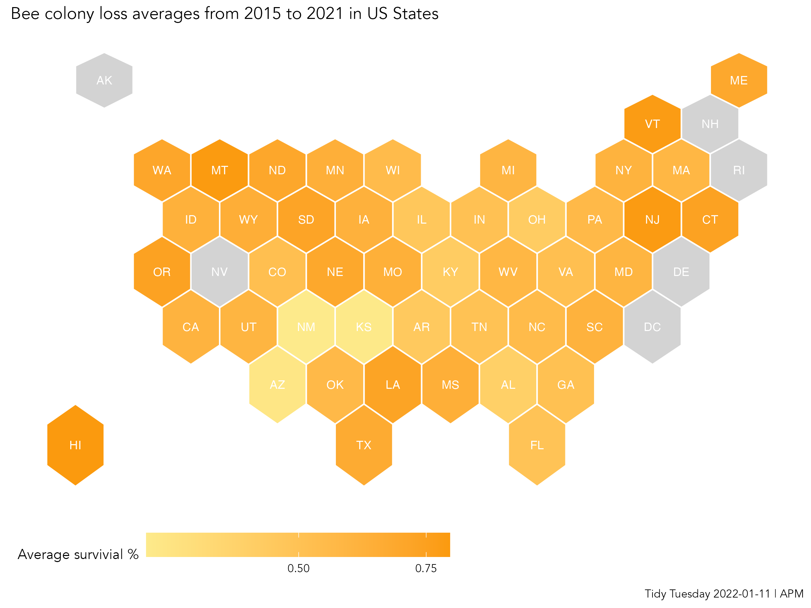

## 2022-01-25 Board games
This attempted using Python with Pandas and Matplotlib, writen in RStudio using reticulate. 
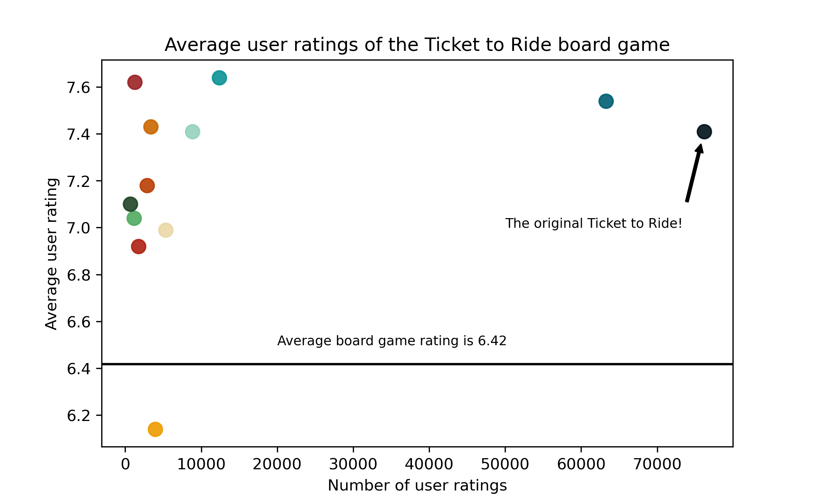
