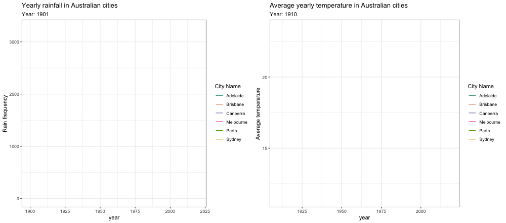
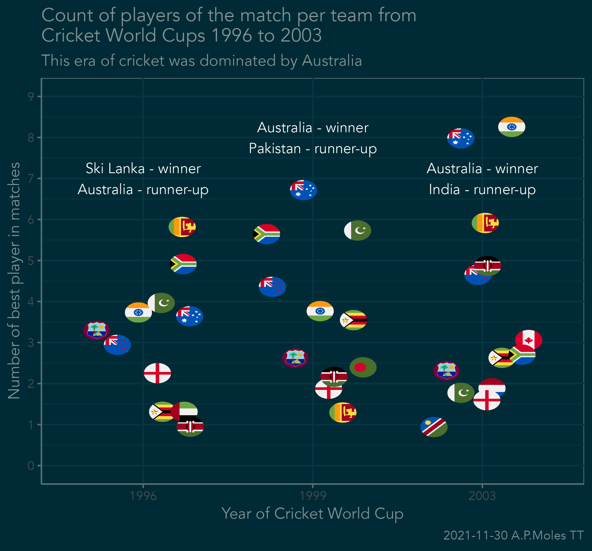
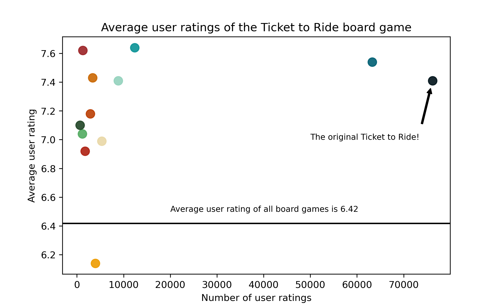

# TidyTuesday

## 2020-01-07 - Australia temperature and rainfall

## 2021-08-24 - Lemurs

## 2021-10-19 - Pumpkins!

## 2021-10-26 - Ultra Trail Running

## 2021-11-11 - Maps (elevation maps with rayshader and elevatr)

## Data from Pokémon games
Scraped from <https://pokemondb.net/>, scraping code on [Github](https://github.com/andrewmoles2/webScraping/blob/main/R/pokemonDatabase.R)

## 2021-11-23 Dr Who

## 2021-11-30 Cricket World Cup (1996-2003)

## 2021-12-07 Spiders

## 2021-12-14 Spice Girls

## 2022-01-11 Bees!

## 2022-01-25 Board games
This attempted using Python with Pandas and Matplotlib, writen in RStudio using reticulate. 

