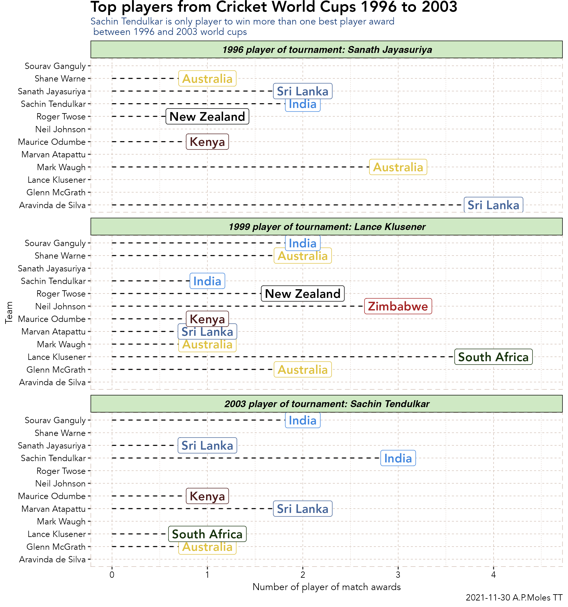
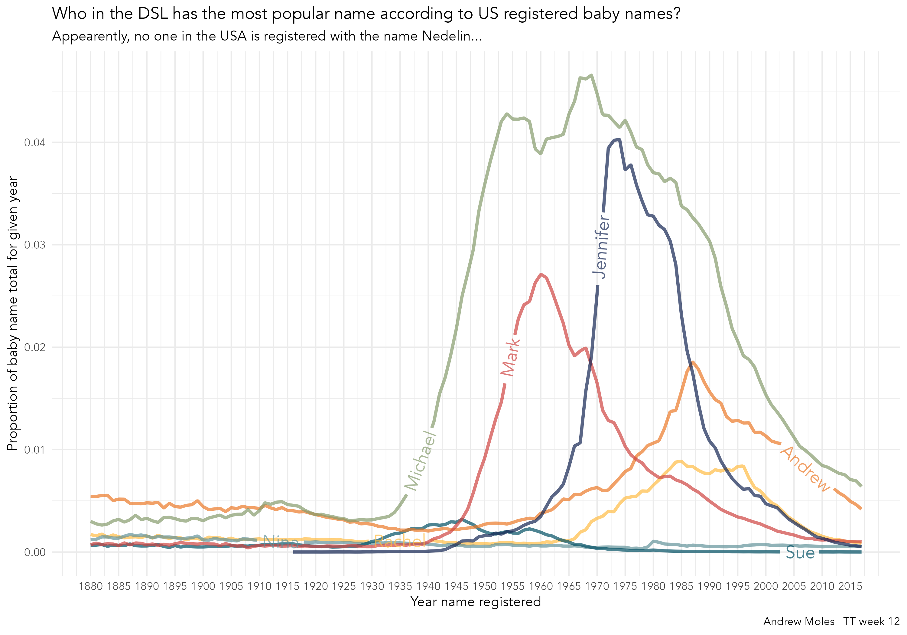
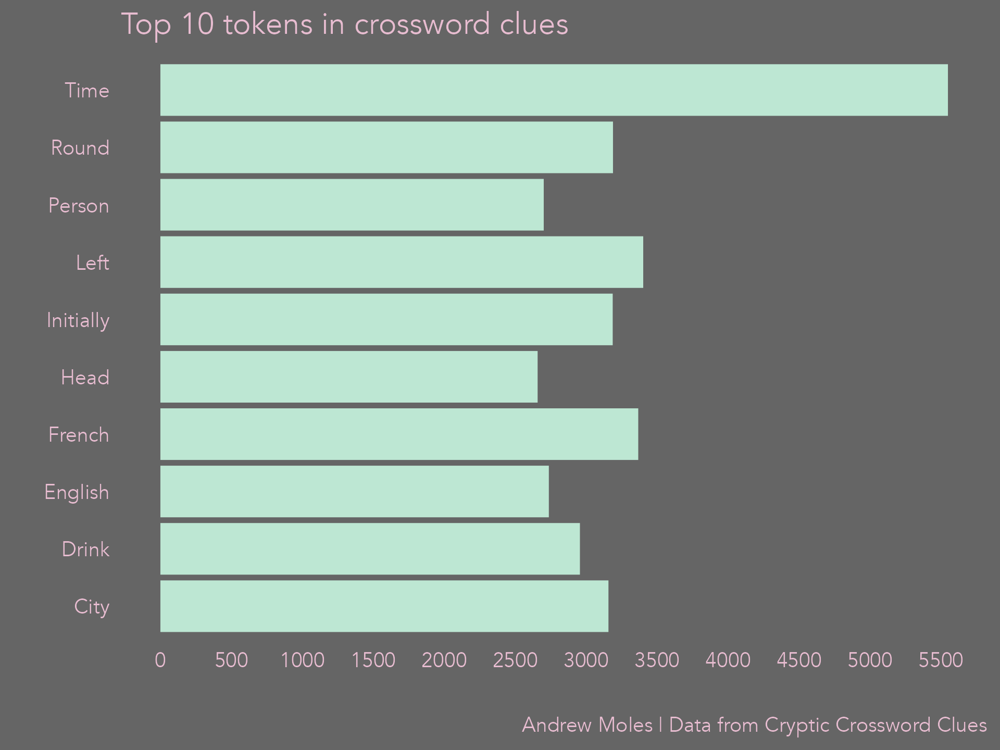
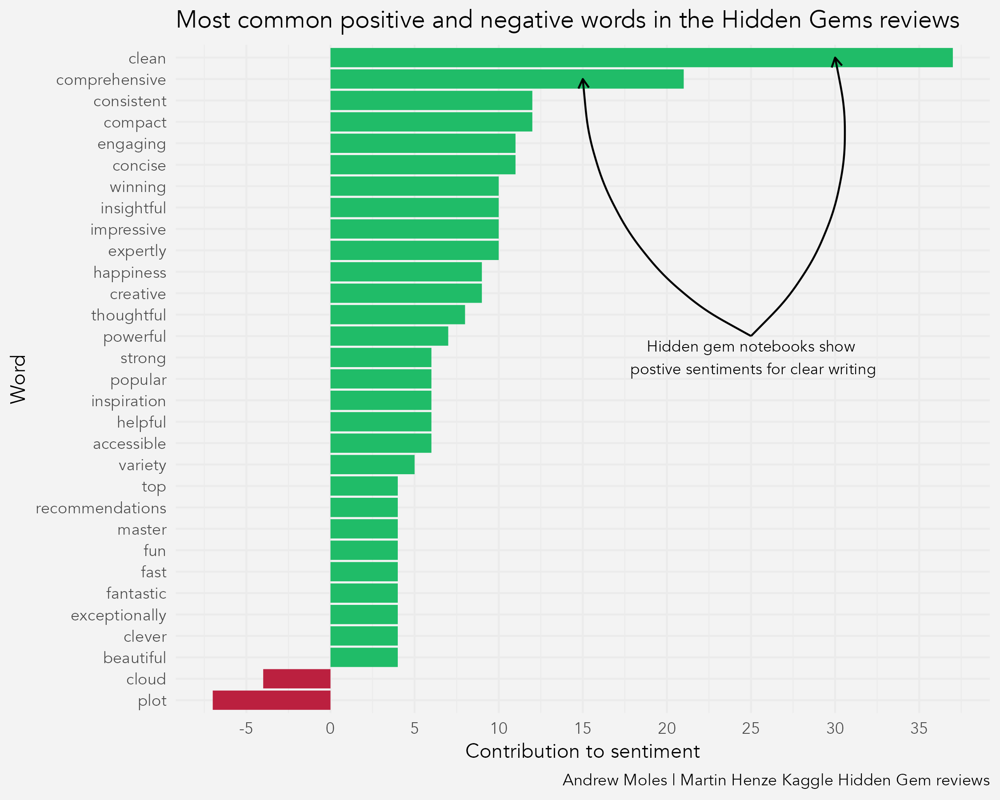
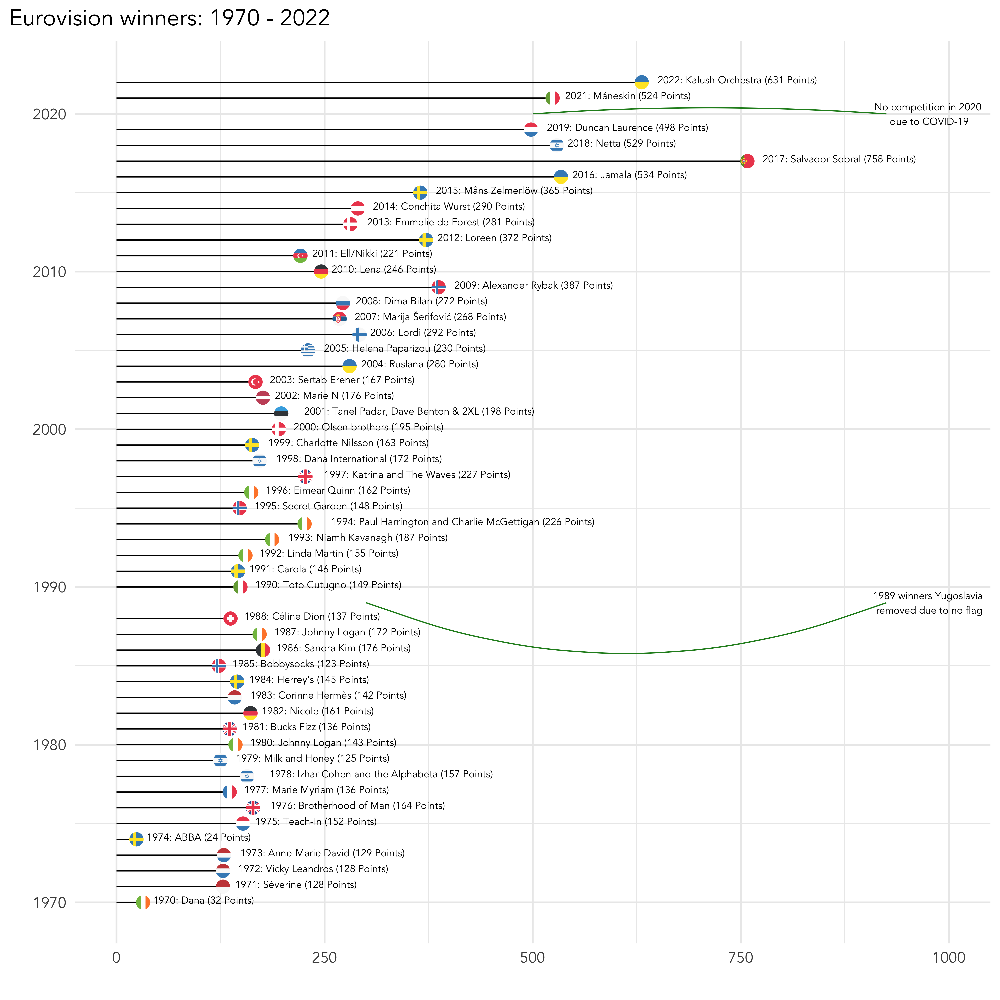
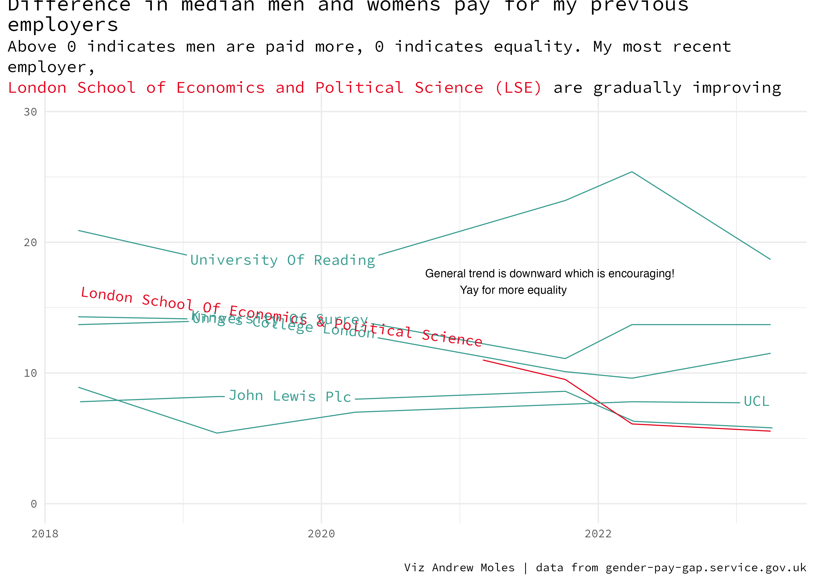

# TidyTuesday

## 2020-01-07 - Australia temperature and rainfall

## 2021-08-24 - Lemurs

## 2021-10-19 - Pumpkins!

## 2021-10-26 - Ultra Trail Running

## 2021-11-11 - Maps (elevation maps with rayshader and elevatr)

<!--
## Data from Pokémon games
Scraped from <https://pokemondb.net/>, scraping code on [Github](https://github.com/andrewmoles2/webScraping/blob/main/R/pokemonDatabase.R)

 -->
 
## 2021-11-23 Dr Who

## 2021-11-30 Cricket World Cup (1996-2003)

## 2021-12-07 Spiders

## 2021-12-14 Spice Girls

## 2022-01-11 Bees!

## 2022-01-25 Board games
This was attempted using Python with Pandas and Matplotlib, writen in RStudio using reticulate. 

## 2022-01-11 Dogs!

## 2022-02-22 Civil and political freedoms

## 2022-03-08 Erasmus

## 2022-03-15 R Vignettes

## 2022-03-22 US Babynames

## 2022-04-19 Crosswords

Using tidytext to extract tokens from the crossword clues

Using the clues in a flow field for more of an aRty feel

## 2022-04-26 Kaggle Hidden Gems
Attempt at text mining sentiments from hidden gems reviews

## 2022-05-10 NYT Best Sellers

## 2022-05-17 Eurovision
Made with Python using pandas and plotnine, using jupyter (+ quorto extension).

The rest are made with R, trying out various things like adding images (flags), and using maps

## 2022-05-24 Womens Rugby
Made with gt and gtExtras.

## 2022-06-28 [Gender Paygap](paygap-2022-06-28)
The first image is a selection of my workplaces and how they are doing in terms of gender pay equality. 

## 2022-11-22 Museums
Playing around with clustering and mapping. 

## 2023-04-25 London Marathon

