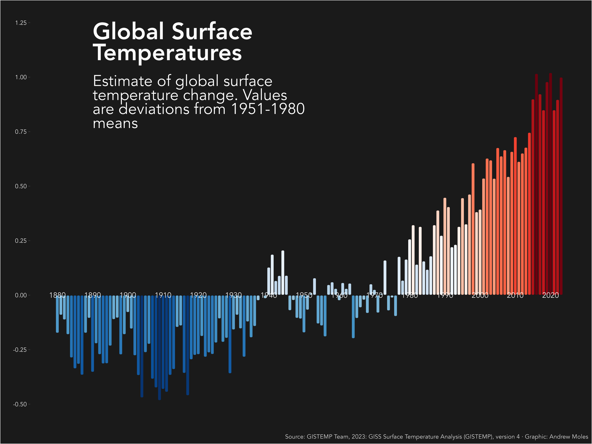

# Global Surface Temperatures

Inspiration and some code come from [Dan Oehm](https://github.com/doehm/tidytues/tree/main/scripts/2023/week-28-temperatures) and [Nicola Rennie](https://github.com/nrennie/tidytuesday/tree/main/2023/2023-07-11)

